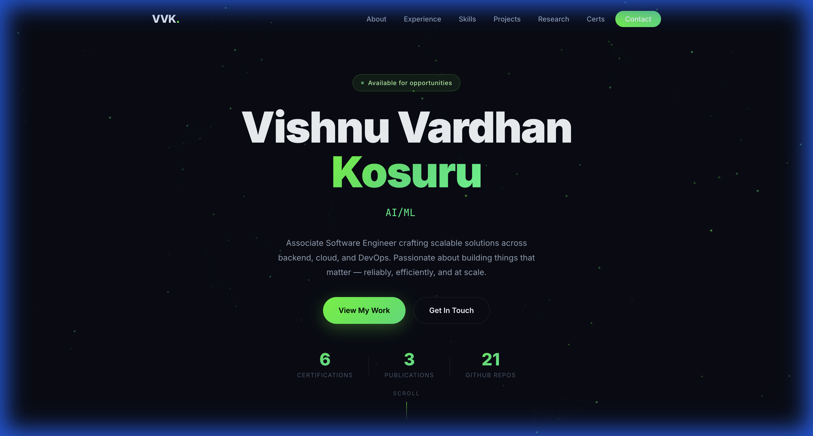
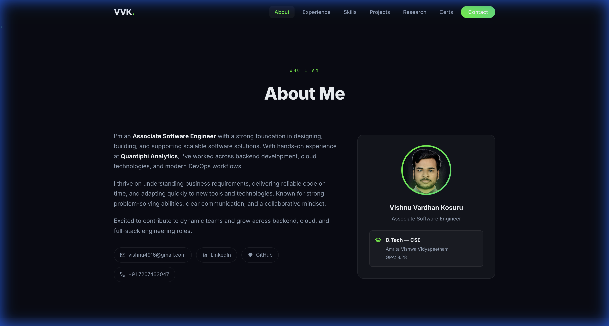

# VVK. — Portfolio

> Personal portfolio of **Vishnu Vardhan Kosuru** — Framework Engineer · Cloud · DevOps



---

## Tech Stack

| Layer | Technology |
|-------|-----------|
| Structure | HTML5 (semantic) |
| Styling | Vanilla CSS3 (custom properties, grid, flexbox) |
| Logic | Vanilla JavaScript (ES6+) |
| Server | Node.js built-in `http` module |

No frameworks. No build tools. No dependencies.

---

## Animations & Visual Effects

- **Particle canvas** — floating green dots on the hero background, drawn via `<canvas>` + `requestAnimationFrame`
- **Typing effect** — cycling role titles with a blinking cursor
- **Scroll reveal** — elements slide in from left/right as you scroll (`IntersectionObserver`)
- **Neon glow hover** — cards lift with a neon green `box-shadow` on hover
- **Spinning avatar ring** — CSS `@keyframes` rotating gradient ring around the profile photo
- **Glassmorphism cards** — `backdrop-filter: blur` + semi-transparent backgrounds
- **Animated gradient border** — hero section border pulses with a neon green glow

---

## Project Structure

```
portfolio/
├── index.html          # Single-page portfolio
├── styles/
│   └── main.css        # All styles & animations
├── scripts/
│   ├── main.js         # Canvas, typing, scroll animations
│   ├── serve.js        # Dev server
│   └── build.js        # Static build script
├── assets/
│   └── profile.jpg     # Profile photo
├── package.json
└── Makefile
```

---

## Run Locally

```bash
npm run dev       # starts at http://localhost:3000
```

---

## About



---

*Designed & Built by **Vishnu Vardhan Kosuru** using **Antigravity** · 2026*
